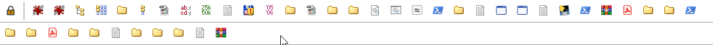

# Total Commander Button Movement

[Русская версия](README.ru.md)

Quickly and easily rearrange application shortcuts in the Total Commander button bar.
For **Total Commander x64** on Windows.



## Install

1. Download `TcBarMove-1.0.0-x64.zip` from [Releases](https://github.com/numbereleven-a/Totalcommander_Bar-Moving-icons/releases/latest).
2. Close Total Commander and extract `TcBarMove.exe` and `TcBarMove.dll` together into the folder containing `TOTALCMD64.EXE`.
3. Start Total Commander. Right-click its horizontal button bar and choose **Change**.
4. Add a button with the settings below and click **OK**.

| Field | Value |
| --- | --- |
| Command | `%COMMANDER_PATH%\TcBarMove.exe` |
| Parameters | The full path to your active `.bar` file, in double quotes |
| Start path | Leave empty |
| Icon file | `%COMMANDER_PATH%\TcBarMove.exe` |
| Icon | `0` — closed lock |
| Tooltip | `Unlock / Lock` |

The active `.bar` path is shown in **Button bar** at the top of the dialog.
Copy that path into **Parameters**, adding double quotes. For example:

```text
"C:\Users\User\AppData\Roaming\GHISLER\default.bar"
```

Use your actual path in place of this example. Leave **Run minimized** and
**Run maximized** unchecked.


## Use

1. Click the lock to enable movement.
2. Hold the left mouse button on a button, drag it to the blue insertion marker, and release.
3. Click the lock again to restore normal button actions.

**Esc** cancels the current drag. Each drop saves the order. The first actual move
after unlocking creates a `.barmove-….bak` backup beside the `.bar` file.
Only the two latest automatic backups are kept for each bar; older ones are removed
after a successful save.
To restore it, close Total Commander and copy the backup over the original `.bar` file.

The lock button stays in place; other buttons cannot cross it. Vertical bars and
moving buttons between bars are not supported. A DPI change locks movement.
Tested with Total Commander **11.58 x64**.

## Update

Close Total Commander completely, replace **both** files, and start it again.
The DLL remains loaded until Total Commander exits.

## Troubleshooting

- **The supplied .bar file does not match the active button bar:** set Parameters
  to the full quoted path shown at the top of the button configuration dialog.
- **Cannot enable button movement:** launch the command using its Total Commander
  button, check that both files are present, and run Total Commander and the helper
  with matching privileges.

## Build

Use PowerShell and an x64 MinGW toolchain:

```powershell
./build.ps1 -Compiler g++.exe
./test.ps1 -Compiler g++.exe
```

The default version is **1.0.0**; `-Version` sets the file and product versions of
both binaries. Builds are kept in `artifacts/<version>/`. If `test-totalcmd` exists
beside the scripts, the build updates its EXE and DLL. Close that test instance
before building if the extension has been loaded.
