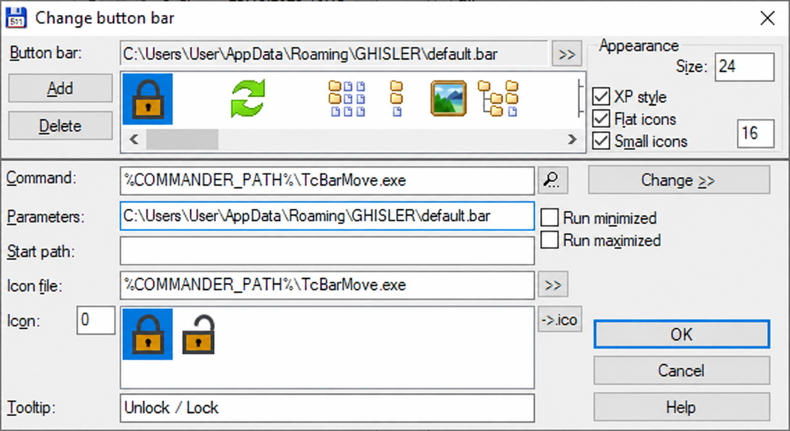

# Total Commander Button Movement

[English](README.md)

Программа предназначена для быстрого и удобного перемещения ярлыков приложений
в панели кнопок (button bar) Total Commander.
Для **Total Commander x64** в Windows.

## Установка

1. Скачайте `TcBarMove-1.0.0-x64.zip` из [Releases](https://github.com/numbereleven-a/Totalcommander_Bar-Moving-icons/releases/latest).
2. Закройте Total Commander и скопируйте `TcBarMove.exe` и `TcBarMove.dll` вместе в папку с `TOTALCMD64.EXE`.
3. Запустите Total Commander. Нажмите правой кнопкой на горизонтальной панели кнопок и выберите **Изменить** (**Change**).
4. Добавьте кнопку с указанными ниже настройками и нажмите **OK**.

| Поле | Значение |
| --- | --- |
| Команда | `%COMMANDER_PATH%\TcBarMove.exe` |
| Параметры | Полный путь к активному файлу `.bar` в двойных кавычках |
| Путь запуска | Оставить пустым |
| Файл значка | `%COMMANDER_PATH%\TcBarMove.exe` |
| Значок | `0` — закрытый замок |
| Подсказка | `Разблокировать / заблокировать перемещение` |

Путь активной панели указан в поле **Панель кнопок** (**Button bar**) сверху окна.
Скопируйте его в **Параметры** и добавьте двойные кавычки. Например:

```text
"C:\Users\User\AppData\Roaming\GHISLER\default.bar"
```

Вместо примера используйте свой путь. Оставьте выключенными опции запуска
в свёрнутом и развёрнутом окне (**Run minimized**, **Run maximized**).



## Использование

1. Нажмите замок, чтобы разрешить перемещение.
2. Зажмите левую кнопку мыши на кнопке, перетащите её к синему маркеру вставки и отпустите.
3. Ещё раз нажмите замок, чтобы вернуть обычную работу кнопок.

**Esc** отменяет текущее перетаскивание. После каждого перемещения порядок сохраняется.
Первое фактическое перемещение после разблокировки создаёт резервную копию
`.barmove-….bak` рядом с файлом `.bar`. Для каждой панели хранятся только две последние
автоматические копии; более старые удаляются после успешного сохранения.
Для восстановления закройте Total Commander
и скопируйте резервную копию поверх исходного файла `.bar`.

Замок остаётся на месте; другие кнопки не могут пересекать его позицию.
Вертикальные панели и перемещение между панелями не поддерживаются.
Смена DPI блокирует перемещение. Проверено с Total Commander **11.58 x64**.

## Обновление

Полностью закройте Total Commander, замените **оба** файла и запустите его снова.
DLL остаётся загруженной до завершения Total Commander.

## Решение проблем

- **The supplied .bar file does not match the active button bar:** укажите в Параметрах
  полный путь в кавычках из верхнего поля окна настройки панели.
- **Cannot enable button movement:** запускайте команду кнопкой внутри Total Commander,
  проверьте наличие обоих файлов и одинаковые права запуска Total Commander и помощника.

## Сборка

Используйте PowerShell и набор инструментов MinGW x64:

```powershell
./build.ps1 -Compiler g++.exe
./test.ps1 -Compiler g++.exe
```

Версия по умолчанию — **1.0.0**. Параметр `-Version` задаёт версии файла и продукта
для обоих исполняемых файлов. Сборки сохраняются в `artifacts/<версия>/`.
Если рядом со скриптами есть папка `test-totalcmd`, сборка обновляет EXE и DLL в ней.
Перед сборкой закройте тестовый экземпляр, если расширение уже загружено.
